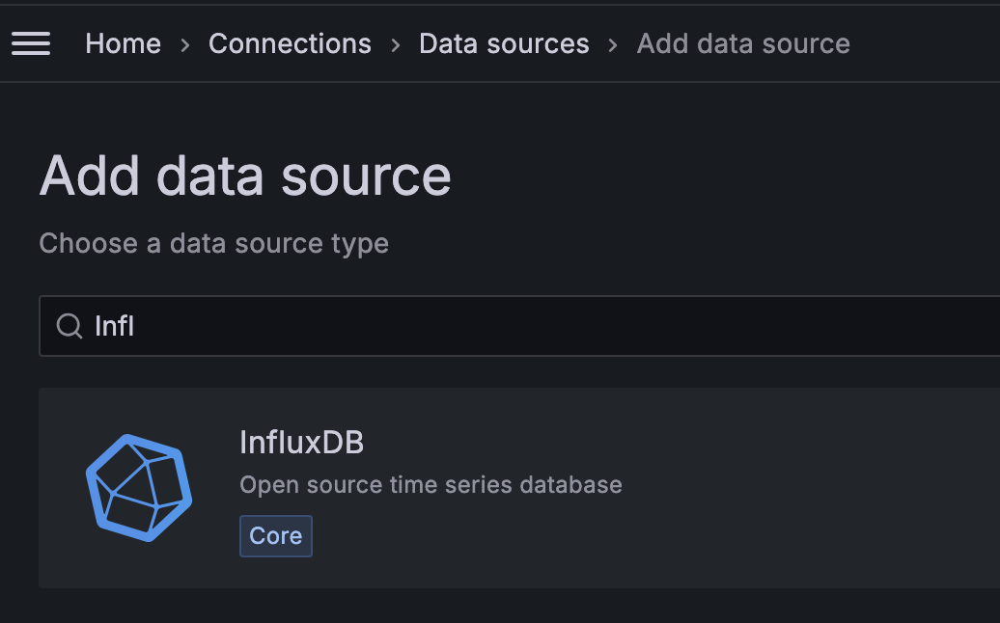
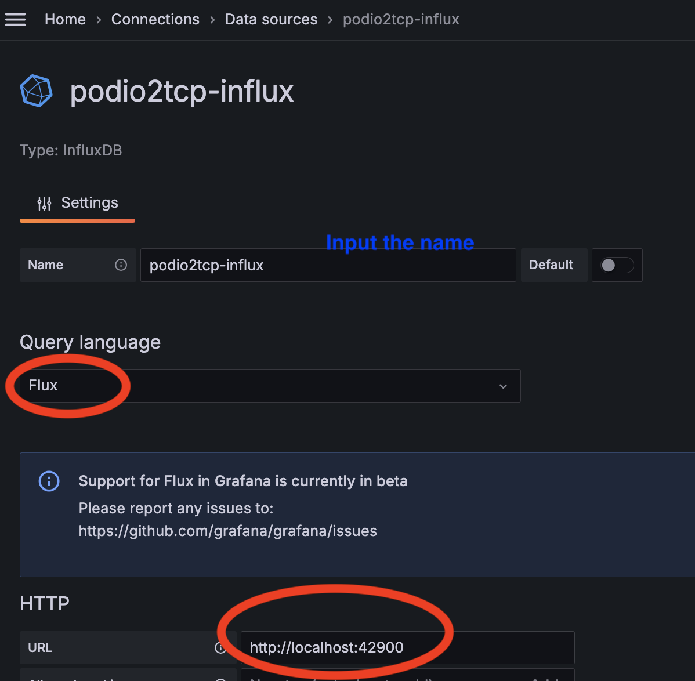
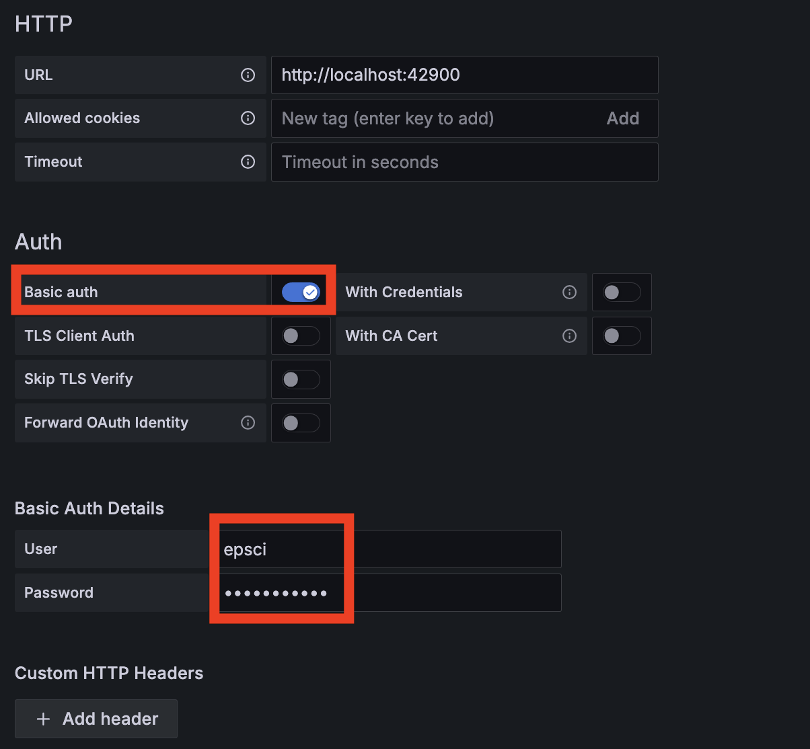
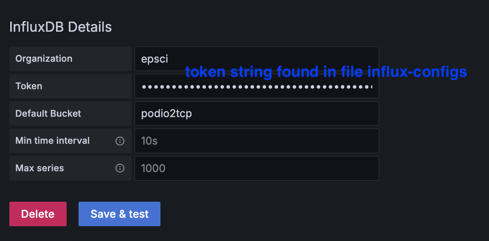
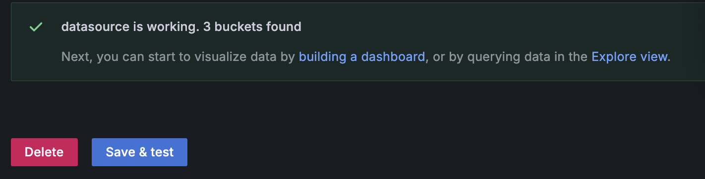
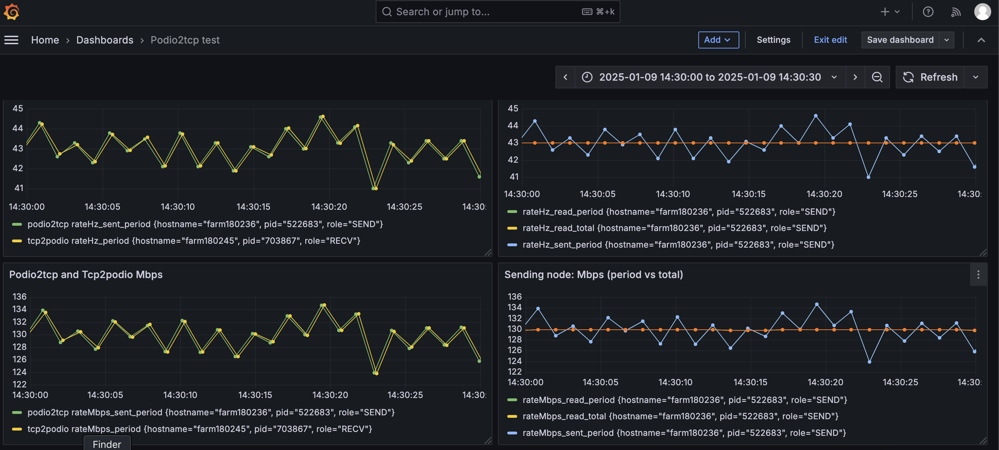

## The `ifarm` InfluxDB+podio2tcp Demonstrator

This directory is to demonstrate how to launch a sender/client and a receiver/server on the JLab `ifarm` cluster with `podio2tcp` and monitor the event rates with [SQLite3](https://www.sqlite.org/about.html), [InfluxDB](https://docs.influxdata.com/influxdb/v2/) and [Grafana](https://grafana.com/docs/grafana/latest/getting-started/).

- Receiver node: a `tcp2podio` instance and a SQLite3 database scraper;
- Sender node: a `podio2tcp` instance and a SQLite3 database scraper;
- InfluxDB node: receive the realtime metrics from the scrapers. Here it's possible to use the login node `ifarm2401` to setup the InfluxDB instance with Apptainer.

### Prerequisites

- Built `podio2tcp` within `eic-shell` as guided [here](../../src/utilities/cpp/podio2tcp/README.md). This will create a `podio2tcp.build` folder at top directory.

    ```bash
    [xmei@ifarm2401 SRO-RTDP]$ ls podio2tcp.build/
    CMakeCache.txt  CMakeFiles  cmake_install.cmake  Makefile  podio2tcp  tcp2podio
    ```

- A ROOT file to send. We use the 50MB file [simout.100.edm4hep.root](../../containers/podio-eicrecon/simout.100.edm4hep.root).
- The InfluxDB Apptainer [container](../sifs/containers) created by `apptainer pull infludb.sif docker://influxdb:latest`.
- Create 2 empty directories `influxdb-data` and `influxdb-config` under `farm-tests` for the InfluxDB.

    ```bash
    [xmei@ifarm2401 SRO-RTDP]$ ls farm-tests/
    config           influxdb-config  query_job_nodelist.bash  sifs                    slurm-podio2tcp-influxdb-demo
    hello_server.py  influxdb-data    README.md                slurm-iperf3-prom-demo  workflow
    ```

### Steps

All the below steps are lauched under the project top directory `SRO-RTDP`.

1. Setup the InfluxDB on the login node `ifarm2401`. It listens to port `42900` for the incoming traffic.
   
    ```bash
    bash farm-tests/slurm-podio2tcp-influxdb-demo/influxdb_start.sh
    ```

    If the script runs successfully, we should see the below output:
    ```
    # Setting the InfluxDB authorization succeeded.
    User    Organization    Bucket
    epsci   epsci           bucket_podio2tcp

    # Create a new InfluxDB log file.
    InfluxDB setup completed, see logs at: influxdb_xxxxxxxxxx.log
    ```

    Double check by printing the processes, we need to see ALL of the 3 processes below.
    ```bash
    [xmei@ifarm2401 SRO-RTDP]$ ps
        PID TTY          TIME CMD
    2745411 pts/58   00:00:00 starter   # apptainer entrance
    2745528 pts/58   00:00:00 squashfuse_ll  # apptainer mounting system
    2745563 pts/58   00:00:01 influxd  # real InfluxDB instance
    ```

2. Submit the sender and receiver jobs with the InfluxDB port number. This will launch 2 Slurm jobs sending events from the sender to the receiver for ~10 minutes.

    ```bash
    bash farm-tests/slurm-podio2tcp-influxdb-demo/submit2jobs.sh 42900
    ```

   Check the 2 job status with `squeue`.
    ```bash
    [xmei@ifarm2401 SRO-RTDP]$ squeue -u xmei
        JOBID PARTITION     NAME     USER ST       TIME  NODES NODELIST(REASON)
    34808962     ifarm  pd-send     xmei  R       5:32      1 farm180207
    34808961     ifarm  pd-recv     xmei  R       5:42      1 farm180245
    ```
   In the sender job log `slurm_<JID>_<HOSTNAME>_send.log`, we can find lines:

    ```bash
    read(sent): 40.2 (40.2) Hz  121.4 (121.4 Mbps) [AVG read/sent: 40.6 (40.6) Hz  122.5 (122.5 Mbps)]  # rates printed by the C++ app

    Read sqlite up to record id=13  # the Bash scraper progress
    ```
   In the receiver job log `slurm_<JID>_<HOSTNAME>_recv.log`, we can find lines:

    ```bash
    43.983 Hz  (132.825 Mbps)   # rates printed by the C++ app

    Read sqlite up to record id=46  # the Bash scraper progress
    ```

### InfluxDB how-tos
- Introduction to InfluxDB [line protocol](https://docs.influxdata.com/influxdb/cloud/get-started/write/#line-protocol).

- Get the InfluxDB token.
  If the apptainer hosted InfluxDB is running, a token string can be found in the file `influx-configs` under `farm-tests/influxdb-config`.
    ```
    [default]
        url = "http://xx.xx.xx.xx:42900"
        token = "alGBJEtESzEI4tRNy-JsAsF8VNpd5sjuOry9twGjzJaNnmFlwiWqj4q-OjGnx5-guDZZvwt3YeifcGAnOSKxCQ=="
        org = "xxx"
        active = true
    ```
- The sender scraper is writing to the InfluxDB `measurement` `podio2tcp` and the receiver scraper is writing to `tcp2podio`.

  [Query](https://docs.influxdata.com/influxdb/cloud/get-started/query/?t=InfluxDB+API) the InfluxDB with API as below:

  - Receiver side - `tcp2podio` measurement.
    ```bash
    bash-5.1$ curl --request POST "$INFLUXDB_URL/query?org=$INFLUXDB_ORG&bucket=${INFLUXDB_BUCKET}" --header "Authorization: Token $INFLUXDB_TOKEN" --data-urlencode "rp=autogen" --data-urlencode "db=bucket_podio2tcp" --data-urlencode "q=SELECT * FROM tcp2podio WHERE time >= '2024-12-11T04:04:24Z'"
    {"results":[{"statement_id":0,"series":[{"name":"tcp2podio","columns":["time","hostname","pid","rateHz_period","rateMbps_period","role"],"values":[["2024-12-11T04:18:15.009Z","farm180228","1380783",0.633,1.912,"RECV"]]}]}]}
    ```
  - Sender side - `podio2tcp` measurement.

    ```bash
    bash-5.1$ curl --request POST "$INFLUXDB_URL/query?org=$INFLUXDB_ORG&bucket=${INFLUXDB_BUCKET}" --header "Authorization: Token $INFLUXDB_TOKEN" --data-urlencode "rp=autogen" --data-urlencode "db=bucket_podio2tcp" --data-urlencode "q=SELECT * FROM podio2tcp WHERE time >= '2024-12-11T04:24:20Z'"
    {"results":[{"statement_id":0,"series":[{"name":"podio2tcp","columns":["time","hostname","pid","rateHz_read_period","rateHz_read_total","rateHz_sent_period","rateHz_sent_total","rateMbps_read_period","rateMbps_read_total","rateMbps_sent_period","rateMbps_sent_total","role"],"values":[["2024-12-11T04:24:20.292Z","farm1972","3773416",46.6,46.8,46.6,46.8,140.7,141.4,140.7,141.4,"SEND"]]}]}]}
    ```

### Port InfluxDB to Grafana
1. Create an empty folder for runtime Grafana data `grafana-data` under folder `farm-tests`. Run Grafana with apptainer on `ifarm2401`.
    ```bash
    $ apptainer exec --bind farm-tests/grafana-data:/var/lib/grafana farm-tests/sifs/grafana.sif grafana server --homepath=/usr/share/grafana &
    ```
   Make sure Grafana is running by curl to local host port 3000 (the default Grafana port).
   ```bash
   $ curl http://localhost:3000
   $ <a href="/login">Found</a>.  # the expected output or Code 302 (for login first)
   ```
2. Port forwarding to the local computer for both Grafana and InfluxDB. Here I use the same local port numbers.
   ```bash
   ssh -J scilogin.jlab.org <user>@ifarm2401.jlab.org -L 3000:localhost:3000   # Grafana
   ssh -J scilogin.jlab.org <user>@ifarm2401.jlab.org -L 42900:localhost:42900   # InfluxDB
   ```
3. Add InfluxDB as the data source of Grafana.
   After login, go to "Home" --> "Connections" --> "Data sources" --> "Add data source", and select InfluxDB.

   

   Configure the data source follow the guides below. The InfluxDB credentials can be found at [influxdb_setenv.bash](influxdb_setenv.bash). The InfluxDB token string is in a file "influx-configs" under folder influxdb-config.

   
   
   

   Click the "Save & test" buttton at the bottom. We should be able to see success message as below.

    

4. Create the Grafana dashboards with InfluxDB's Flux query language. Below is a sample to show the Hz and Mbps numbers on both sending and receiving nodes.
   
