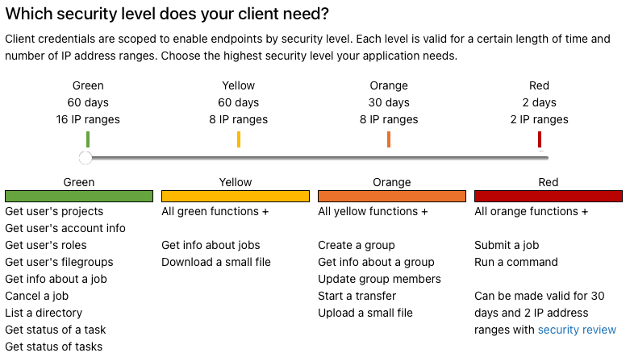

# Superfacility API at NERSC

## Learning about the Superfacility API at NERSC based on the following questions

1. What does Superfacility API do?
2. How to use the API?
3. What functions in Superfacility API are we interested in?
4. What requires to build a API for our own facility?

## What does Superfacility API do?
    The API can be used to script jobs or workflows running against NERSC systems. The goal is to support everything from a simple script that submits a job to complex workflows that move files, check job progress and make advance compute time reservations.

## How to use the API?
There is a [API endpoint](https://api.nersc.gov/api/v1.2) or a [python interface](https://docs.nersc.gov/services/sfapi/examples/) and its [git repo](https://github.com/NERSC/sfapi_client). Notice that each endpoint requires different credentials. One can check the required credentials by clicking on the endpoint and then check `Extensions.x-nersc-scope`.

* 4 credentials that can be used to access the API:

* To apply for the credentials, go to [Iris](https://iris.nersc.gov/) and click on `Profile`, find `Superfacility API Clients`, and click on `New Client` to apply for the credentials.

## What functions in Superfacility API are we interested in?
I think we are interested in the following functions at the start:
1. Upload and download small files.
2. Transfer files via Globus.
3. Submit jobs.
4. Check the status of jobs.

## What requires to build a API for our own facility?
1. Integration with the facility's authentication system with API authentication.
2. Build an interface bewteen `SWIF2` and the API.
