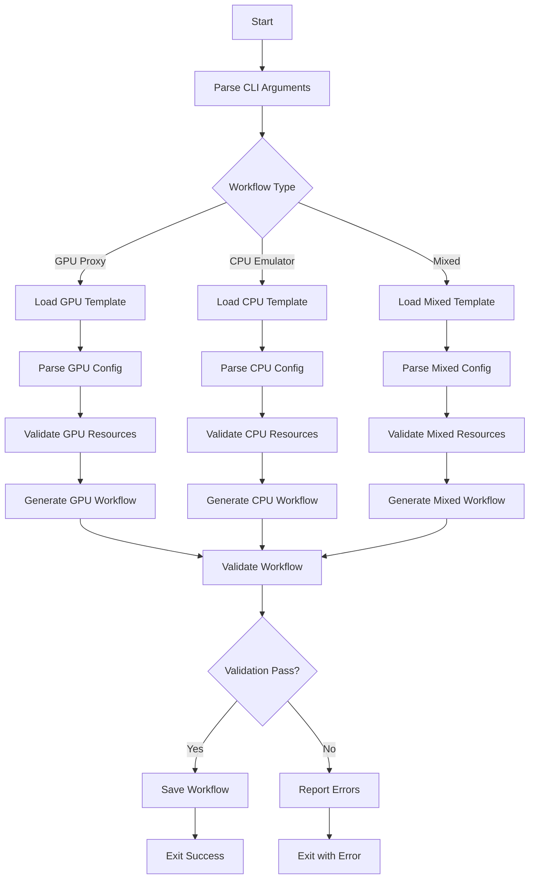
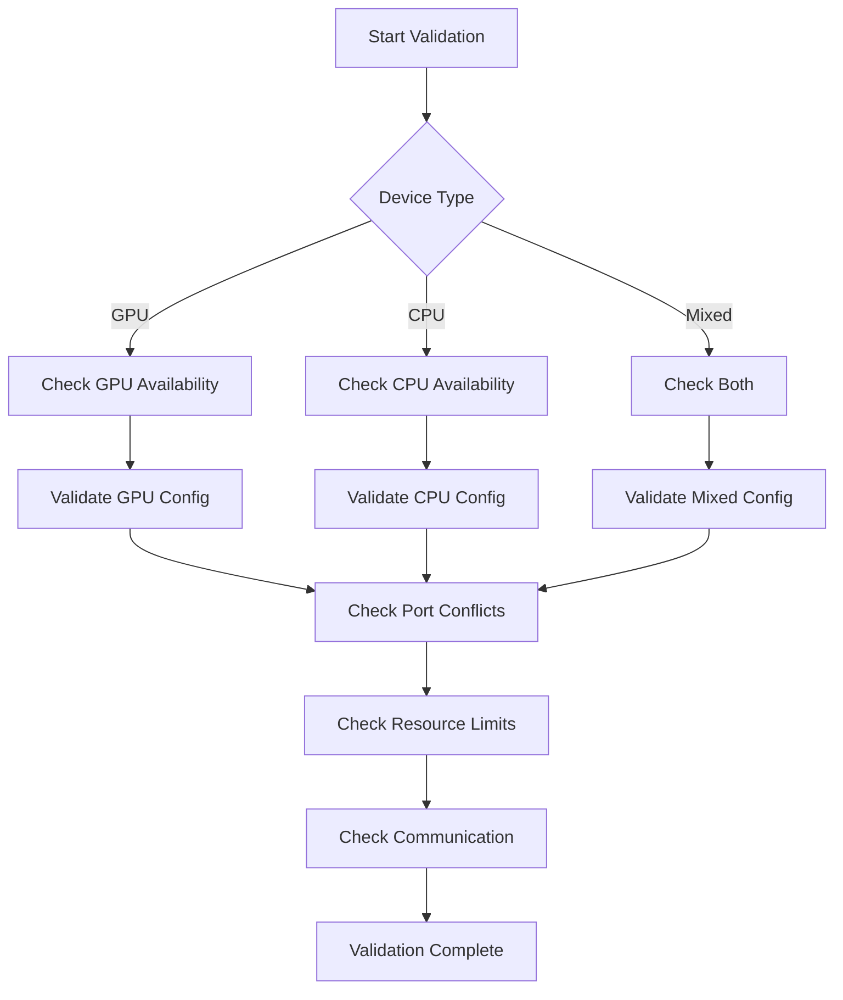
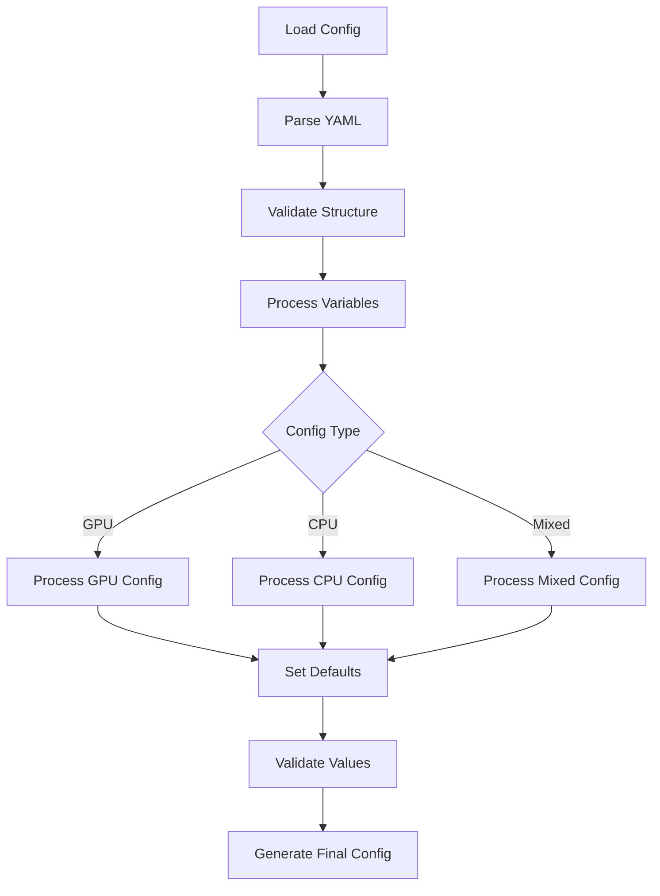
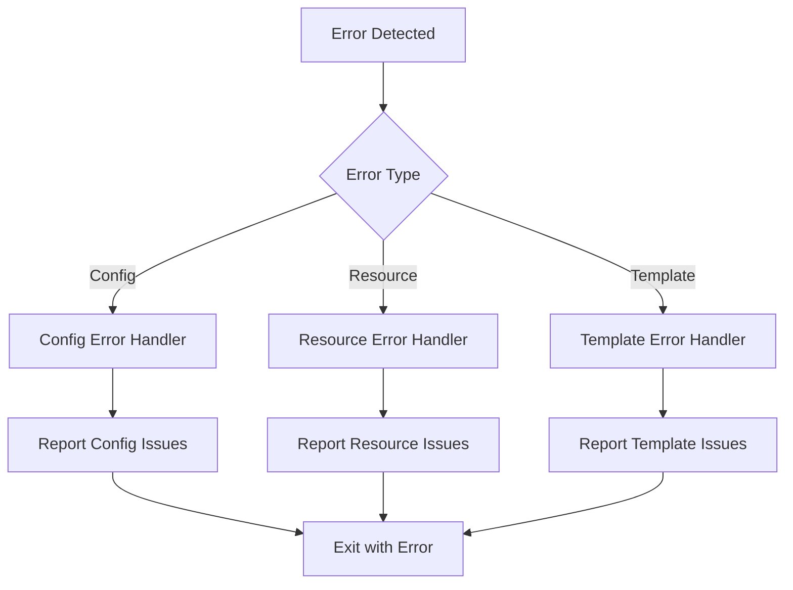
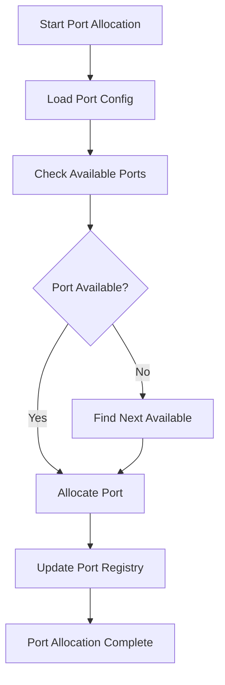
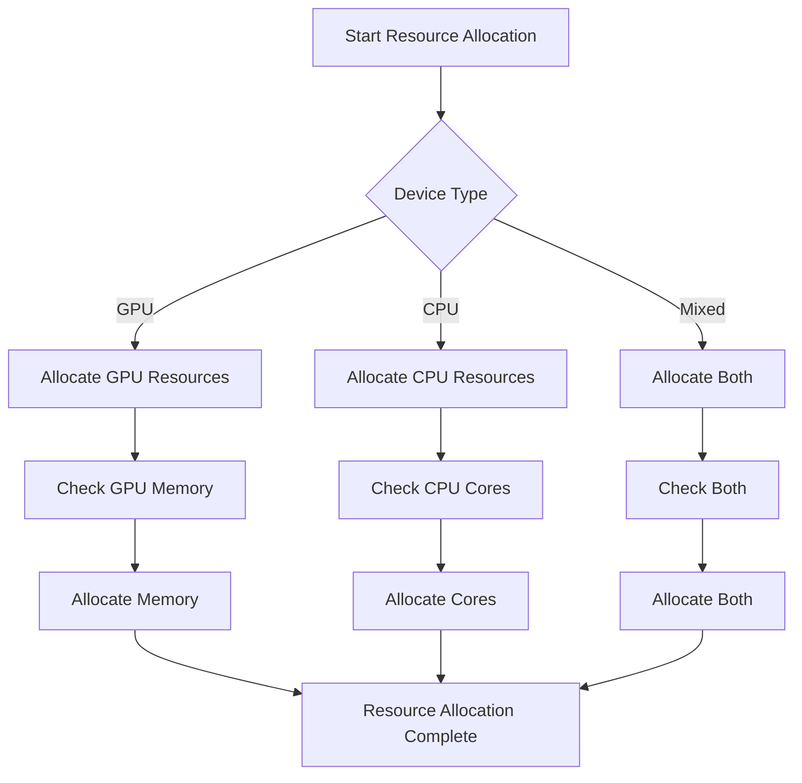

# RTDP Workflow CLI Flowchart

## Workflow Generation Process

```mermaid
graph TD
    A[Start] --> B[Parse CLI Arguments]
    B --> C{Workflow Type}
    
    C -->|GPU Proxy| D[Load GPU Template]
    C -->|CPU Emulator| E[Load CPU Template]
    C -->|Mixed| F[Load Mixed Template]
    
    D --> G[Parse GPU Config]
    E --> H[Parse CPU Config]
    F --> I[Parse Mixed Config]
    
    G --> J[Validate GPU Resources]
    H --> K[Validate CPU Resources]
    I --> L[Validate Mixed Resources]
    
    J --> M[Generate GPU Workflow]
    K --> N[Generate CPU Workflow]
    L --> O[Generate Mixed Workflow]
    
    M --> P[Validate Workflow]
    N --> P
    O --> P
    
    P --> Q{Validation Pass?}
    Q -->|Yes| R[Save Workflow]
    Q -->|No| S[Report Errors]
    S --> T[Exit with Error]
    R --> U[Exit Success]
```

## Resource Validation Process

```mermaid
graph TD
    A[Start Validation] --> B{Device Type}
    
    B -->|GPU| C[Check GPU Availability]
    B -->|CPU| D[Check CPU Availability]
    B -->|Mixed| E[Check Both]
    
    C --> F[Validate GPU Config]
    D --> G[Validate CPU Config]
    E --> H[Validate Mixed Config]
    
    F --> I[Check Port Conflicts]
    G --> I
    H --> I
    
    I --> J[Check Resource Limits]
    J --> K[Check Communication]
    K --> L[Validation Complete]
```

## Configuration Processing

```mermaid
graph TD
    A[Load Config] --> B[Parse YAML]
    B --> C[Validate Structure]
    C --> D[Process Variables]
    
    D --> E{Config Type}
    E -->|GPU| F[Process GPU Config]
    E -->|CPU| G[Process CPU Config]
    E -->|Mixed| H[Process Mixed Config]
    
    F --> I[Set Defaults]
    G --> I
    H --> I
    
    I --> J[Validate Values]
    J --> K[Generate Final Config]
```

## Error Handling Flow

```mermaid
graph TD
    A[Error Detected] --> B{Error Type}
    
    B -->|Config| C[Config Error Handler]
    B -->|Resource| D[Resource Error Handler]
    B -->|Template| E[Template Error Handler]
    
    C --> F[Report Config Issues]
    D --> G[Report Resource Issues]
    E --> H[Report Template Issues]
    
    F --> I[Exit with Error]
    G --> I
    H --> I
```

## Port Management

```mermaid
graph TD
    A[Start Port Allocation] --> B[Load Port Config]
    B --> C[Check Available Ports]
    C --> D{Port Available?}
    
    D -->|Yes| E[Allocate Port]
    D -->|No| F[Find Next Available]
    F --> E
    
    E --> G[Update Port Registry]
    G --> H[Port Allocation Complete]
```

## Resource Allocation

```mermaid
graph TD
    A[Start Resource Allocation] --> B{Device Type}
    
    B -->|GPU| C[Allocate GPU Resources]
    B -->|CPU| D[Allocate CPU Resources]
    B -->|Mixed| E[Allocate Both]
    
    C --> F[Check GPU Memory]
    D --> G[Check CPU Cores]
    E --> H[Check Both]
    
    F --> I[Allocate Memory]
    G --> J[Allocate Cores]
    H --> K[Allocate Both]
    
    I --> L[Resource Allocation Complete]
    J --> L
    K --> L
``` 