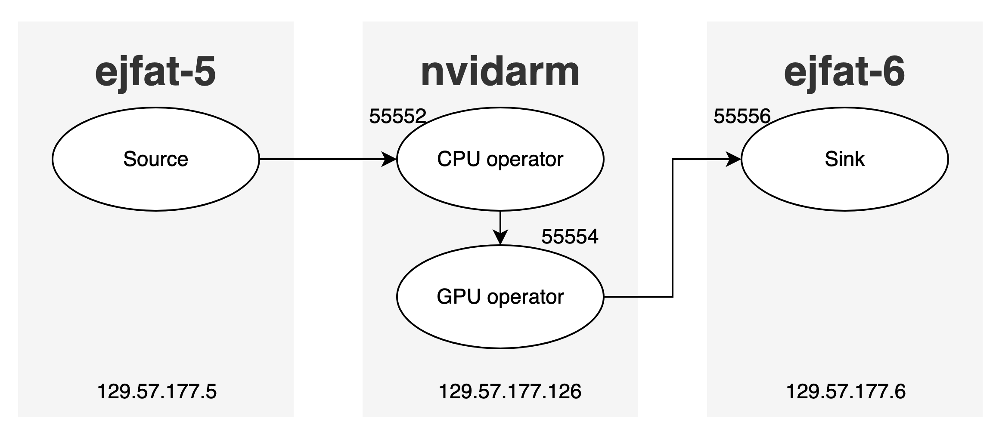
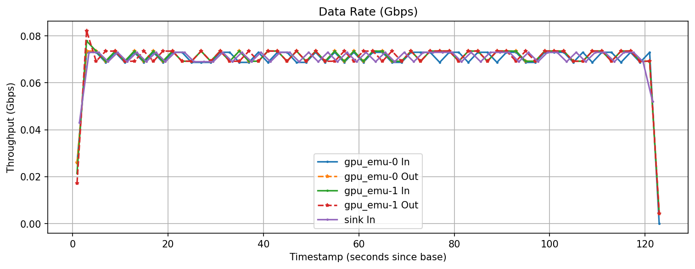
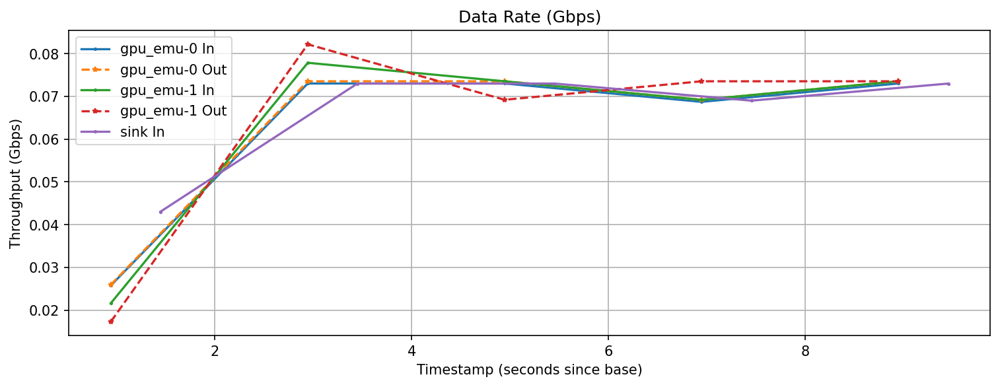
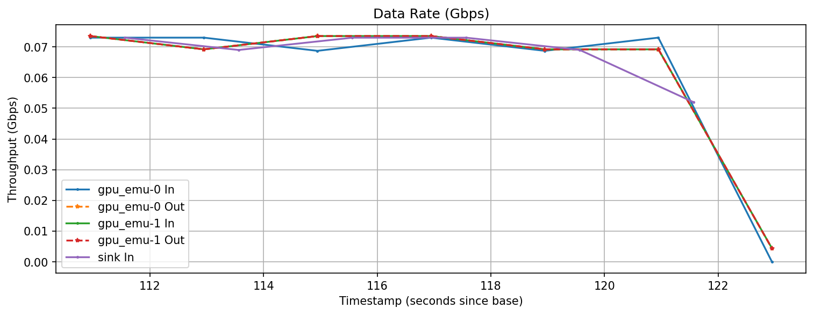

# RTDP Emulation Components

## Quick Start Build and Install (CMake)
### Build Requirements
- C++17-capable compiler (`g++`, `clang++`).
- `libzmq` (ZeroMQ) and headers. If system headers are missing, the build will fall back to `external/zmq/`.
- `libyaml` (C libyaml, not yaml-cpp) and headers.
- CMake ≥ 3.16.
- Threads/Pthread support.
- **Optional for `gpu_emu`:** CUDA Toolkit (tested with 12.8), including `cudart`, `cublas`, and `curand`. Building on systems without CUDA simply skips the GPU target.

If ZeroMQ or libyaml live in non-standard prefixes, set `CMAKE_PREFIX_PATH`, `ZeroMQ_ROOT`, or `YAML_ROOT` before configuring CMake.

### Install Dependencies
- On Ubuntu systems, install the development packages for both dependencies using apt: `sudo apt install -y libzmq3-dev libyaml-dev pkg-config`.

  This provides the C ZeroMQ headers (/usr/include/zmq.h), libraries (/usr/lib/x86_64-linux-gnu/libzmq.so), and YAML headers (/usr/include/yaml.h) with the corresponding shared library (libyaml.so).

- On RHEL/CentOS systems, use dnf or yum to install the matching -devel packages: `sudo dnf install -y zeromq-devel libyaml-devel pkgconfig`
  These ensure CMake’s find_package(ZeroMQ) and find_package(YAML) (with custom FindZeroMQ.cmake / FindYAML.cmake modules if needed) can detect the include directories and link libraries automatically.

- Always verify installation with `pkg-config --cflags --libs libzmq` and `pkg-config --cflags --libs yaml-0.1` to confirm the paths are correctly registered.


### Build and Install
```bash
# From SRO-RTDP/rtdp
rm -rf build bin                    # clean existing build
mkdir -p build && cd build          # chdir to build
cmake -DCMAKE_INSTALL_PREFIX=.. ..  # set install path to /SRO-RTDP/rtdp/bin
make -j 64                          # build the project
make install                        # install targets
```

After the above steps, the executables should be installed to `/SRO-RTDP/rtdp/bin`, along with some helper scripts.

## Emulation Components Overview

- `zmq-event-emu-clnt`: A simple ZeroMQ PUB sender that generates size-jittered payloads at a target bit rate and publishes them on a given port. Designed to feed cpu_emu/gpu_emu during tests and demos, with options for event size, count, rate, and verbosity.

- `cpu_emu`: A C++17 CPU emulator that subscribes to ZeroMQ frames, applies configurable synthetic load (sleep or memory/compute burn) with controllable memory footprint and latency, then forwards results downstream unless set as a terminal node. Useful for staging multi-stage CPU pipelines and measuring throughput, buffering, and saturation effects.

- `gpu_emu`: A CUDA-based GPU proxy that receives frames over ZeroMQ, transfers them to GPU memory, performs a matrix multiply (with optional Tensor Core path), and sends a reduced result onward. It exercises PCIe transfers and GPU compute to prototype GPU stages in the data path.

### Demo Workflow on `ejfat` Testbed

Above is a workflow runned on JLab EJFAT testbed, where

- Source: zmq-event-emu-clnt
- CPU operator: 2 chained cpu_emu
- GPU operator: 2 channed gpu_emu
- Sink: Python zmq SUB receiver

```
# Assume all the executables are compiled and built under ${HOME}/SRO-RTDP/rtdp/bin
# Current dir: SRO-RTDP/rtdp/bin

## On nvidarm (mid node), launch 2 `gpu_emu` and 2 `cpu_emu` instances
[nvidarm bin]$ bash demo_bash_operator_helper.bash --components 2 --mode 1 --end-port 55556
[nvidarm bin]$ bash demo_bash_operator_helper.bash --components 2 --mode 0 --end-port 55554 --sub-ip 129.57.177.5

## On ejfat-6 (sink node), launch a Python SUB receiver
[ejfat-6 bin]$ python zmq_fp_receiver.py --host 129.57.177.126

## On ejfat-5 (source node), launch the CPU sender
# Cannot chain cpu_emu here because PUB/SUB seems short-live that my typing speed cannot catch up
# [ejfat-5 bin]$ demo simple_bash_operator_helper.bash --components 2 --mode 0 --end-port 55552 --sub-ip 127.0.0.1
[ejfat-5 bin]$ ./zmq-event-emu-clnt -p 55552 -c 1000  # sent 1000 events, about 1G data
```

We plot the data rates based on the [run logs](./demo_run_log/), where a total of 1G data (1K frames) are transferred across 3 nodes.

Full view:


First 10 seconds:


Last 10 seconds:

