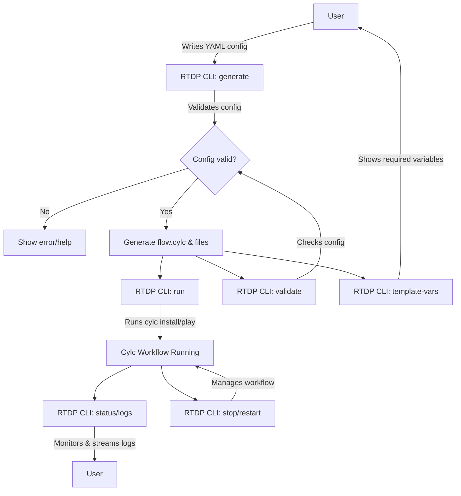

# RTDP Workflow CLI: Design Diagrams

## 1. High-Level Flowchart

This flowchart illustrates the main user interactions and CLI operations for the RTDP Workflow CLI.



---

## 2. Category Chart (Functional Areas)

This chart shows the main functional areas of the CLI and their relationships.

```mermaid
graph TD
    CLI[RTDP Workflow CLI]
    CLI --> Gen[Workflow Generation]
    CLI --> Run[Workflow Execution]
    CLI --> Mon[Workflow Monitoring]
    CLI --> Mgmt[Workflow Management]
    Gen -->|Input| Config[User YAML/JSON Config]
    Gen -->|Output| Cylc[flow.cylc, configs]
    Run -->|Uses| Cylc
    Run -->|Calls| CylcCmd[Cylc install/play]
    Mon -->|Reads| Status[Workflow Status/Logs]
    Mgmt -->|Controls| Cylc
    CLI --> Doc[Documentation/Help]
    CLI --> Ext[Extensibility (Plugins)]
```

---

## 3. Component/Command Category Table

| Category             | Subcommands/Features                | Description                                 |
|----------------------|-------------------------------------|---------------------------------------------|
| Workflow Generation  | `generate`, `validate`, `template-vars` | Create and validate workflow configs        |
| Workflow Execution   | `run`                               | Launch workflows via Cylc                   |
| Workflow Monitoring  | `status`, `logs`, `list`            | Monitor, list, and stream workflow status   |
| Workflow Management  | `stop`, `restart`, `remove`         | Manage workflow lifecycle                   |
| Documentation/Help   | `help`, `template-vars`             | Show help, required variables, examples     |
| Extensibility        | Plugin system                       | Add new component types or workflow logic   |

</rewritten_file> 